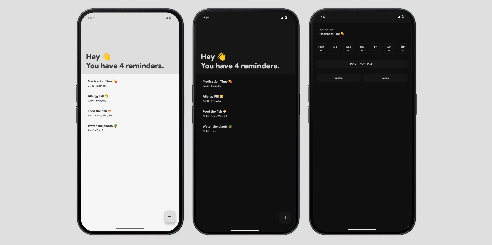

# HeyReminder 👋

HeyReminder is a simple and useful Android application that allows users to create daily reminders and receive scheduled notifications at specific times.

## 🤖 About This Project

This application was entirely created with the assistance of artificial intelligence (AI).  
All the code and implementation steps were guided and generated by AI based on prompt instructions.  
The human contributor acted as the creative director — providing design preferences and defining the vision of the app through prompts — while the AI handled the execution of every technical detail.

This serves as a demonstration of how powerful and collaborative AI-assisted development can be.

## ✨ Features

- ✅ Add reminders with day and time selection
- 🔔 Notification support
- 🌓 Light and Dark theme support
- 📅 Daily repeat functionality
- 💾 Persistent storage with SharedPreferences

## 🖼️ Screenshots




## 🚀 Getting Started

1. Clone this repository:
   ```bash
   git clone https://github.com/ghostyapps/HeyReminder_Android.git
   ```
2. Open it with Android Studio
3. Click the `Run` button to build and launch the app 🚀

## 🛠️ Built With

- Kotlin
- Jetpack Compose
- Android Notifications
- SharedPreferences
- Material 3

## 📃 License

This project is licensed under the MIT License. See the `LICENSE` file for details.
